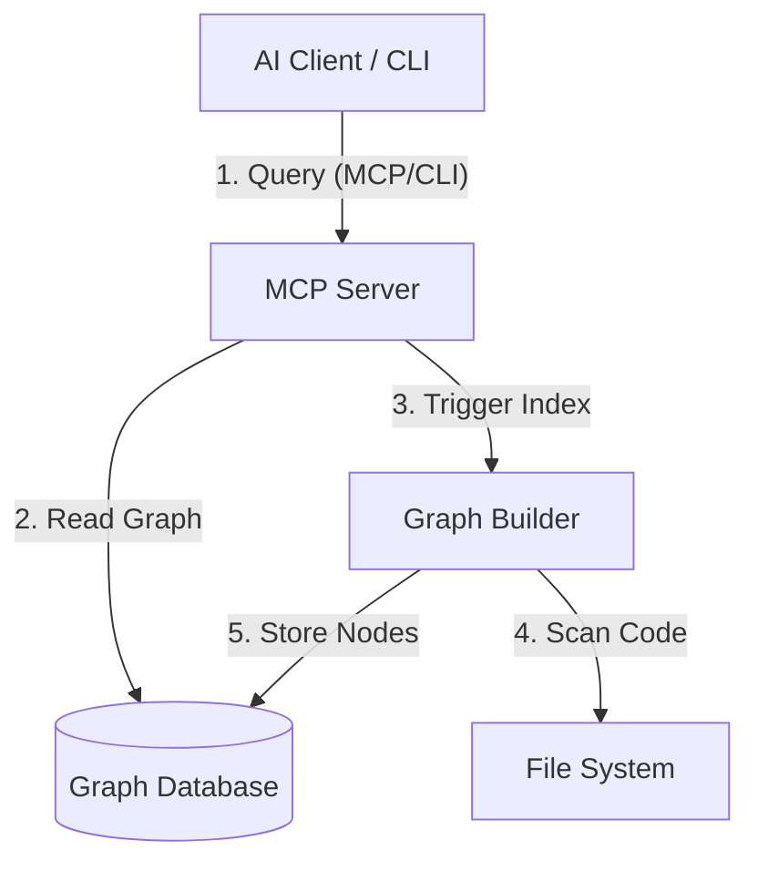

# System Architecture

CodeGraphContext (CGC) is a **context-aware code intelligence engine** that bridges the gap between your source code and your AI tools.

It operates primarily as a background service (MCP Server) backed by a graph database, with a CLI for management.

## High-Level Diagram

## 1. The Core (Backend)

The "brain" of the operation lives in `src/codegraphcontext`. It is a pure Python application.

| Component | Responsibility |
| :--- | :--- |
| **Server (`server.py`)** | Acts as the [Model Context Protocol (MCP)](https://modelcontextprotocol.io/) host. It translates JSON requests from Claude/Cursor into database queries. |
| **Graph Builder** | The "indexer". It parses your code using **Tree-sitter**, extracts dependencies, and builds the knowledge graph. |
| **Database Layer** | An abstraction layer that talks to either **FalkorDB** (embedded) or **Neo4j** (production). |
| **Background Jobs** | Handles long-running tasks like "Index the entire repo" or "Watch for file changes" without blocking the AI. |
| **Watcher** | A file system monitor that triggers incremental re-indexing when you save a file. |

## 2. No "Frontend" Application

**Important:** CodeGraphContext does **not** have a traditional web application frontend.
The `website/` folder you see in the repository is strictly for **documentation** (this site).

Instead of a custom UI, we rely on:

1.  **AI Chat Interfaces:** Your existing IDE chat (Cursor, VS Code) is the UI.
2.  **Neo4j Browser:** For advanced users wanting a raw visual exploration of the graph (available at `localhost:7474` if using Neo4j).
3.  **Visualizer Tool:** The CLI can generate standalone HTML files (`cgc visualize`) using Vis.js for quick inspections.

## 3. Data Flow

1.  **Indexing:**
    *   `cgc index .` -> Scans files -> Parses AST -> Creates Nodes (Functions, Classes) and Edges (CALLS, INHERITS) -> Saves to DB.
2.  **Querying (Natural Language):**
    *   User asks "Who calls function X?" -> MCP Server receives request -> Runs Cypher Query (`MATCH (n)-[:CALLS]->(m)...`) -> Returns context to LLM.

## 4. Key Technologies

*   **Language:** Python 3.10+
*   **Parsing:** Tree-sitter (for robust, multi-language support)
*   **Protocol:** Model Context Protocol (MCP)
*   **Database:** FalkorDB (via Redis) or Neo4j
*   **CLI:** Typer / Click 
